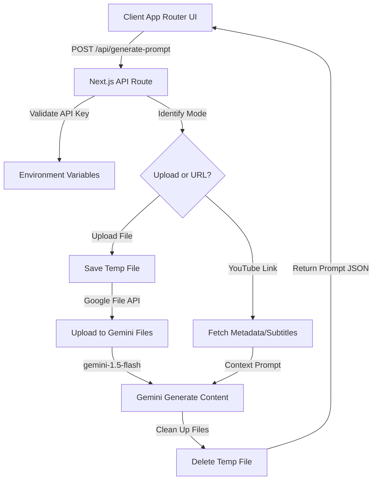

# System Blueprint: Video to Prompt Backend Integration

This document outlines the architecture, requirements, API specifications, and implementation steps for building the backend features of the **Video to Prompt** website.

---

## 1. System Requirements

The backend must support three main workflows:
1. **File Upload Mode**:
   - Accept video uploads (up to 20MB) or image uploads (up to 10MB) via multi-part form data.
   - Stream or temporarily save the uploaded file.
   - Upload the file to the Google Gemini File API.
   - Run multimodal analysis using `gemini-1.5-flash` to generate the prompt.
   - Clean up temporary files on completion.
2. **YouTube Link Mode**:
   - Accept a YouTube/Shorts URL.
   - Fetch video/audio or subtitle data (using helper utilities) or query a fast thumbnail/frame-extracting service.
   - Send context to Gemini for prompt synthesis.
3. **Security & Rate Limiting**:
   - Keep the `GEMINI_API_KEY` hidden from the client.
   - Rate limit requests to prevent abuse of the API key.

---

## 2. System Architecture & Data Flow



---

## 3. API Contract Specifications

### `POST /api/generate-prompt`

This endpoint handles both file uploads and YouTube URL processing.

#### Request (Multipart Form Data)
- **File Mode**:
  - `file`: The binary video/image file.
  - `type`: Either `"video"` or `"image"`.
- **URL Mode**:
  - `url`: YouTube/Shorts link string (e.g. `https://youtube.com/shorts/...`).
  - `type`: `"video"`.

#### Successful Response (`200 OK`)
```json
{
  "success": true,
  "prompt": "A cinematic tracking shot of a futuristic cyberpunk city under heavy rain, neon lights reflecting on wet streets...",
  "details": {
    "model": "gemini-1.5-flash",
    "detectedType": "video"
  }
}
```

#### Error Response (`400 Bad Request` or `500 Server Error`)
```json
{
  "success": false,
  "error": "Failed to upload file to Gemini API",
  "code": "GEMINI_UPLOAD_ERROR"
}
```

---

## 4. Implementation Phases

```
┌────────────────────────────────────────────────────────┐
│ Phase 1: Environment Setup & SDK Integration          │
│ - Configure .env.local with GEMINI_API_KEY             │
│ - Install `@google/generative-ai` SDK                  │
└───────────────────────────┬────────────────────────────┘
                            ▼
┌────────────────────────────────────────────────────────┐
│ Phase 2: Implement File Upload handling                │
│ - Create Next.js API route handling Multipart form     │
│ - Save temporary uploads and pipe to Gemini File API   │
└───────────────────────────┬────────────────────────────┘
                            ▼
┌────────────────────────────────────────────────────────┐
│ Phase 3: Implement YouTube Metadata Extraction        │
│ - Process YouTube URLs and query transcript/subtitles  │
│ - Send video context prompt to Gemini API             │
└───────────────────────────┬────────────────────────────┘
                            ▼
┌────────────────────────────────────────────────────────┐
│ Phase 4: Connect UI & Verify E2E Flow                  │
│ - Update Frontend triggers to send fetch requests      │
│ - Implement loading states & copy-to-clipboard actions  │
└────────────────────────────────────────────────────────┘
```
